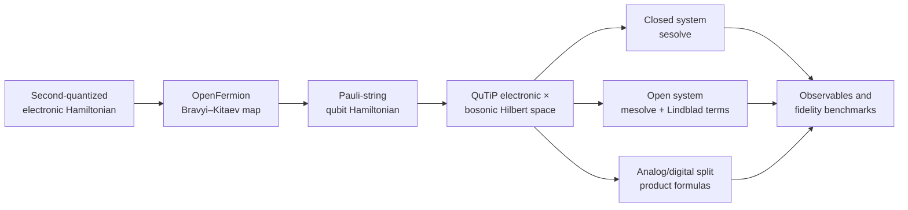
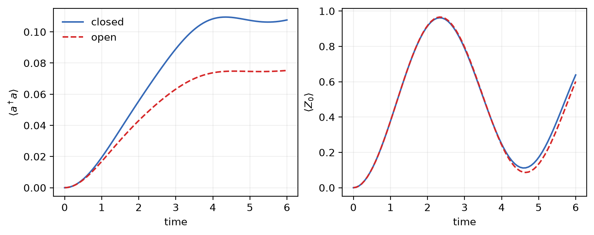
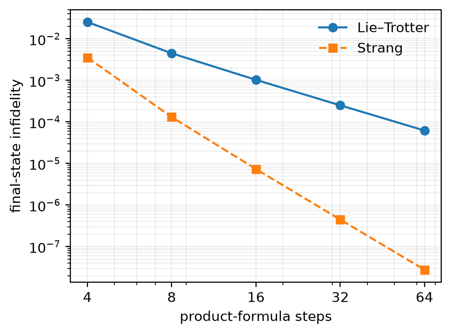
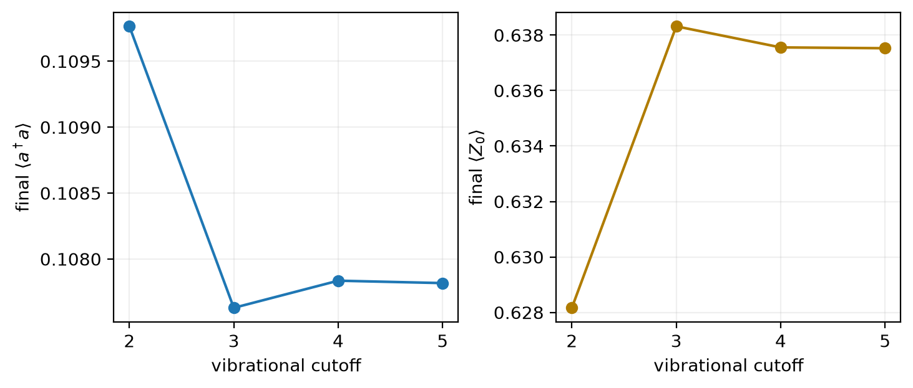
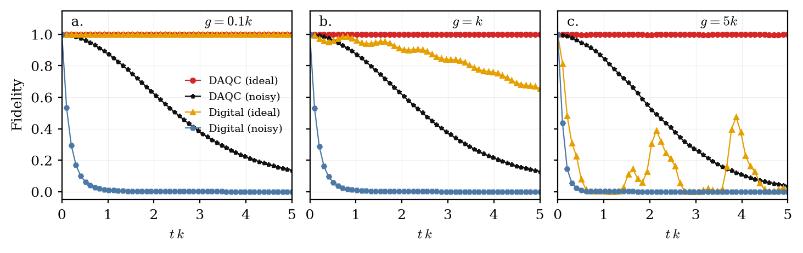
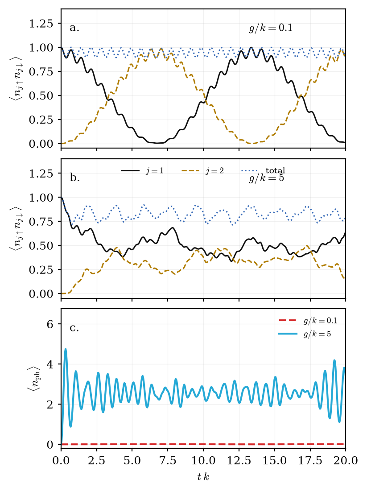

# Digital–Analog Quantum Simulation of Fermion–Boson Models

[中文说明](README_zh-CN.md) · [Notebook index](docs/notebook-index.md) · [Methods](docs/methodology.md)

A research portfolio repository for mapping second-quantized electronic Hamiltonians to qubit operators and simulating coupled electronic–vibrational dynamics. The workflows combine **OpenFermion** for fermion-to-qubit transformations with **QuTiP** for closed- and open-system dynamics, plus product-formula studies for digital–analog simulation.

## What this project demonstrates

- Construction of a four-spin-orbital H₂ electronic Hamiltonian in second quantization.
- Bravyi–Kitaev mapping from fermionic operators to Pauli-string qubit Hamiltonians.
- Coupling of encoded electronic degrees of freedom to truncated bosonic modes.
- Comparison of unitary Schrödinger evolution and Lindblad master-equation dynamics.
- First-order Lie–Trotter and second-order Strang decompositions benchmarked against exact propagation, with committed convergence data.
- Reproducible plotting of the reference DAQC fidelity and Hubbard–Holstein dynamics data.



## Start here

| Workflow | Purpose |
| --- | --- |
| [`examples/h2_vibronic_open_system.py`](examples/h2_vibronic_open_system.py) | Compact end-to-end OpenFermion → QuTiP closed/open-system example |
| [`01_h2_single_vibrational_mode.ipynb`](notebooks/applications/01_h2_single_vibrational_mode.ipynb) | Step-by-step H₂ electronic Hamiltonian and one vibrational mode |
| [`03_hubbard_holstein_trotter_sweep.ipynb`](notebooks/models/03_hubbard_holstein_trotter_sweep.ipynb) | Product-formula accuracy across several Trotter step counts |
| [`02_qutip_quantum_gates.ipynb`](notebooks/tutorials/02_qutip_quantum_gates.ipynb) | Gate propagators and circuit composition in QuTiP-QIP |

Run the compact portfolio example:

```bash
python -m venv .venv
# Windows: .venv\Scripts\activate
# macOS/Linux: source .venv/bin/activate
python -m pip install -e .
python examples/h2_vibronic_open_system.py
```

The defaults are intentionally small for a quick smoke test. For a denser run, use `--vibrational-levels 6 --stop-time 12 --time-points 160` and check convergence against still larger cutoffs.

For all notebooks and tutorials, install `requirements.txt` or create the Conda environment:

```bash
conda env create -f environment.yml
conda activate daqc-fermion-boson
jupyter lab
```

## Results

The complete reproducible H₂-reference study produces three concrete findings for the documented test parameters:

- Vibrational damping and dephasing lower the final boson occupation from `0.107630` to `0.075222` (30.1%).
- At 64 product-formula steps, final-state infidelity is `6.22e-5` for Lie–Trotter and `2.77e-8` for Strang.
- Raising the bosonic cutoff from 4 to 5 changes the final boson occupation by only `1.83e-5`, supporting convergence of the reported observable.

Full-precision metrics, assumptions, and limitations are in [`RESULTS.md`](RESULTS.md); the underlying tables are in [`results/`](results/README.md).

Closed- versus open-system dynamics:



Product-formula convergence:



Bosonic-cutoff convergence:



Additional reference-data reproductions are also retained. Reference fidelity comparison:



Double occupancy and boson-number dynamics:



Regenerate both figures with:

```bash
python scripts/plot_reference_figures.py
```

Run the complete H₂-reference study—open-system dynamics, product-formula convergence, and bosonic-cutoff convergence—with:

```bash
python experiments/run_h2_study.py
```

## Repository structure

| Path | Contents |
| --- | --- |
| `examples/` | Short, reviewable end-to-end workflows |
| `experiments/` | Parameterized studies that generate results and figures |
| `src/daqc/` | Reusable model, noise, and product-formula implementation |
| `results/` | Machine-readable outputs from the complete study |
| `notebooks/applications/` | Molecular and H₂ simulation studies |
| `notebooks/models/` | Hubbard–Holstein, Jaynes–Cummings, iSWAP, and trajectory models |
| `notebooks/tutorials/` | QuTiP and QuTiP-QIP learning material |
| `data/raw/` | Numerical data used by the reference plots |
| `scripts/` | Plotting, notebook cleaning, and validation tools |
| `archive/` | Early experiments retained for provenance, not presented as validated results |

See [`docs/notebook-index.md`](docs/notebook-index.md) for the complete notebook catalogue and original filename mapping.

## Reproducibility status

- All 28 notebooks are valid JSON and are stored without transient outputs or local machine paths.
- Data shape, local documentation links, and notebook cleanliness are checked by `scripts/validate_repository.py` and GitHub Actions.
- Generated CSV/JSON result schemas and finite numeric values are checked automatically.
- The reusable model implementation is covered by unit tests, including Hamiltonian Hermiticity, shared tensor dimensions, finite open-system dynamics, and product-formula convergence.
- The standalone portfolio example uses physically applied damping and dephasing rates in its Lindblad collapse operators.
- Large interactive outputs are generated locally under `outputs/` and excluded from Git.

This is a research and learning repository, not a claim of ab-initio chemical accuracy or execution on quantum hardware. The featured H₂ coefficients are manually supplied reference values, bosonic Hilbert spaces are truncated, and circuit material currently demonstrates synthesis building blocks rather than a complete hardware compiler. Earlier multi-mode molecular prototypes with unresolved modelling assumptions are kept in `archive/` and clearly labelled.

## Reference

S. Kumar *et al.*, “Digital-analog quantum computing of fermion-boson models in superconducting circuits,” *npj Quantum Information* **11**, 43 (2025). [DOI: 10.1038/s41534-025-01001-4](https://doi.org/10.1038/s41534-025-01001-4)

GitHub can generate citation metadata from [`CITATION.cff`](CITATION.cff).

## License

Released under the [MIT License](LICENSE). Copyright © 2026 Andy Wu.
