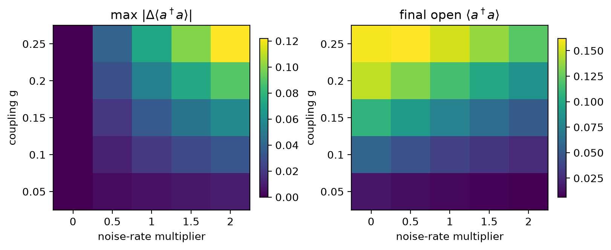
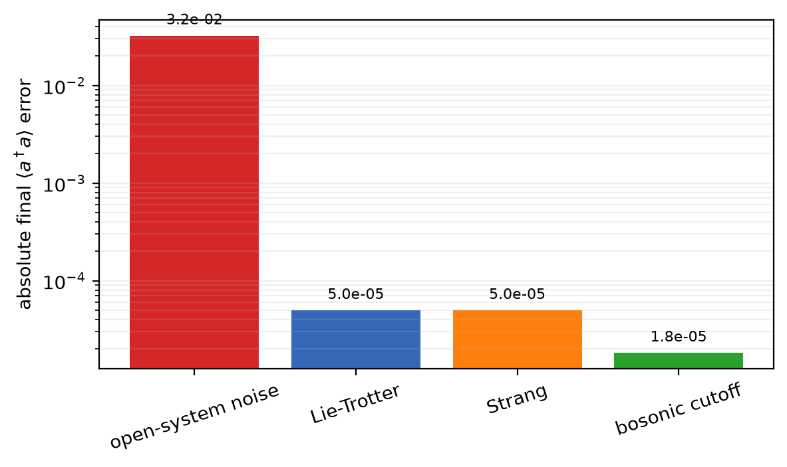

# Results: H₂-reference vibronic DAQS study

This study asks how Lindblad noise, product-formula order, and bosonic truncation affect a four-qubit H₂-reference electron–vibration simulation. The coefficients are manually supplied reference values; the study evaluates the numerical workflow, not ab-initio chemical accuracy.

## Configuration

- Bravyi–Kitaev Pauli terms: **19**
- Joint Hilbert-space dimension: **48**
- Vibrational cutoff: **3**
- Coupling: **0.15**; mode frequency: **1.0**
- Open-system parameters: **T1 = 5.0**, **T2 = 4.0**
- Evolution interval: **0–6.0**

## Main findings

1. Vibrational damping and dephasing reduced the final boson occupation from **0.107630** to **0.075222** (**30.1%**). The maximum closed/open boson-number separation over the trajectory was **0.034921**.
2. At **64** product-formula steps, Lie–Trotter infidelity was **6.215e-05**, while Strang infidelity was **2.772e-08**.
3. The empirical log–log infidelity slopes versus step count were **-2.152** (Lie) and **-4.214** (Strang), consistent with the expected `steps^-2` and `steps^-4` infidelity scaling for this test.
4. Increasing the bosonic cutoff from **2** to **5** changed the final boson occupation by **1.948e-03**. More importantly for convergence, the change between the final two cutoffs was only **1.827e-05** (and **3.012e-05** for `Z0`).
5. Across **25** coupling/noise combinations, the largest trajectory-level boson-number separation was **1.221e-01**, at coupling **0.25** and noise-rate multiplier **2.0**.
6. On the common final-boson-number scale, the baseline errors were **3.241e-02** (noise), **4.983e-05** (Lie–Trotter), **4.983e-05** (Strang), and **1.827e-05** (last cutoff increment). These sources have different physical meanings; the shared observable makes their numerical sizes directly comparable.

## Figures






## Reproduce

```bash
python -m pip install -e .
python experiments/run_h2_study.py
```

Machine-readable outputs and their column definitions are stored in [`results/`](results/README.md). Re-run after changing model parameters; do not compare cutoffs or product-formula orders without regenerating the corresponding CSV files.
